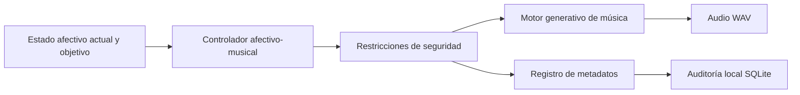

# MAG-RE Capa 4: Actuador Musical Generativo Adaptativo

## Qué es este prototipo
Este proyecto implementa un avance real y funcional de la Capa 4 de MAG-RE: la capa de música generativa adaptativa, entendida como un actuador musical parametrizable. Recibe un estado afectivo actual, un estado afectivo objetivo y una configuración de sesión; traduce esa intención de regulación en parámetros musicales seguros; genera una pieza en formato WAV; y registra la decisión junto con sus metadatos en SQLite.

## Qué parte de MAG-RE implementa
MAG-RE plantea un flujo general:



Este avance implementa una versión mínima de la Capa 4 como actuador musical generativo. El sistema recibe una intención de regulación y genera música parametrizada mediante tempo, modo, densidad, timbre o brillo y dinámica o volumen.

## Qué NO hace
- No realiza diagnóstico psicológico.
- No hace tratamiento clínico.
- No valida clínicamente la eficacia de la intervención.
- No sustituye evaluación profesional.
- No usa modelos propietarios ni servicios de pago.

## Instalación
Requisitos recomendados:
- Python 3.11 o superior
- `pip`

Instalación local:

```bash
cd /home/sinoe/MAG_RE/magre-capa4
python3 -m venv .venv
source .venv/bin/activate
pip install -r requirements.txt
```

## Ejecución
Levantar el servidor:

```bash
cd /home/sinoe/MAG_RE/magre-capa4
python run.py
```

La aplicación quedará disponible en:

```text
http://localhost:8000
```

## Cómo probar desde navegador
1. Abrir `http://localhost:8000`.
2. Ingresar el estado afectivo actual y el objetivo.
3. Elegir duración, semilla y nombre de sesión si se desea.
4. Hacer clic en `Generar intervención musical`.
5. Revisar parámetros musicales, metadatos JSON y reproducir o descargar el WAV.

La interfaz muestra la advertencia obligatoria:

> Este prototipo no realiza diagnóstico ni tratamiento clínico; solo demuestra una capa técnica de generación musical adaptativa.

## Cómo probar con curl
Generar intervención:

```bash
curl -X POST http://localhost:8000/api/generate \
  -H "Content-Type: application/json" \
  -d '{
    "session_name": "prueba_001",
    "duration_seconds": 20,
    "seed": 123,
    "current_state": {
      "arousal": 0.75,
      "valence": 0.30,
      "stress": 0.80,
      "engagement": 0.40
    },
    "target_state": {
      "arousal": 0.35,
      "valence": 0.65,
      "stress": 0.30,
      "engagement": 0.60
    }
  }'
```

Listar sesiones:

```bash
curl http://localhost:8000/api/sessions
```

Consultar una sesión:

```bash
curl http://localhost:8000/api/sessions/SESSION_ID
```

## Arquitectura
- `app/controller.py`: calcula parámetros musicales crudos a partir de la diferencia entre estado actual y objetivo.
- `app/safety.py`: aplica restricciones de seguridad y registra cada corrección.
- `app/music_engine.py`: sintetiza el audio WAV por capas usando NumPy y SciPy.
- `app/storage.py`: guarda y consulta sesiones en SQLite.
- `app/main.py`: expone UI, API y archivos generados.
- `static/`: contiene una interfaz HTML/CSS/JS simple sin frameworks pesados.

## Mapeo afectivo-musical
La relación afectiva usada es una aproximación técnica y no clínica:

- tempo y densidad se usan como controles de activación o arousal;
- modo se usa como aproximación de valencia;
- brillo y volumen se limitan por seguridad;
- estrés alto reduce intensidad, brillo y densidad;
- el sistema prioriza seguridad sobre expresividad musical.

Reglas implementadas:
- Si el objetivo requiere bajar arousal, se reduce tempo, densidad y volumen.
- Si el objetivo requiere subir arousal, se aumenta tempo, densidad y actividad melódica.
- Valence alta favorece `major` o `lydian`.
- Valence media favorece `major` o `dorian`.
- Valence baja favorece `minor` o `dorian`.
- Engagement alto permite más melodía y variación.
- Objetivos más relajados favorecen más pad y menor complejidad rítmica.

## Seguridad
Las restricciones mínimas aplicadas incluyen:

- `bpm` entre `60` y `130`;
- `volume` entre `0.05` y `0.25`;
- `brightness` entre `0.1` y `0.8`;
- `note_density` entre `0.5` y `3.0`.

Además:
- si `stress_actual > 0.75`, se limita `volume` a `0.18`;
- si `stress_actual > 0.75`, se limita `brightness` a `0.55`;
- si hay estrés alto y el objetivo baja arousal, `bpm` no excede `110`;
- si `target_state.arousal < 0.4`, `note_density` no supera `1.5`;
- toda corrección queda registrada en `safety_actions`.

## Pruebas
Ejecutar:

```bash
cd /home/sinoe/MAG_RE/magre-capa4
pytest
```

Cobertura funcional esperada:
- validación de restricciones de seguridad;
- consistencia del controlador afectivo-musical;
- generación real de WAV con sample rate `44100`.

## Limitaciones
- La síntesis es simple y orientada a demostración, no a producción musical avanzada.
- El mapeo afectivo-musical es heurístico y explicable, no clínicamente validado.
- El audio se genera en mono para mantener el MVP claro y estable.
- No hay autenticación, multiusuario ni almacenamiento remoto.

## Próximos pasos
- Añadir variaciones formales más ricas sin comprometer seguridad.
- Incorporar perfiles de intervención configurables para experimentación.
- Integrar trazas comparativas entre sesiones para análisis académico.
- Añadir evaluación perceptual o experimental en fases posteriores del proyecto.

## Cómo defenderlo como avance real
Se puede presentar así:

> Se implementó un prototipo funcional de la Capa 4 de MAG-RE. El sistema recibe un estado afectivo actual y un estado objetivo, traduce esa diferencia en parámetros musicales seguros, genera una pieza musical adaptativa en formato WAV, registra los metadatos de la decisión y permite probarlo desde navegador o API. No pretende validar clínicamente la intervención, pero sí demuestra técnicamente cómo la música generativa puede funcionar como actuador afectivo parametrizable dentro de MAG-RE.

## Por qué este avance sí es tangible
Este prototipo no resuelve toda la tesis, pero sí entrega un avance demostrable con:
- código ejecutable;
- interfaz local;
- API reproducible;
- audio generado;
- seguridad explícita;
- trazabilidad y auditoría local.
